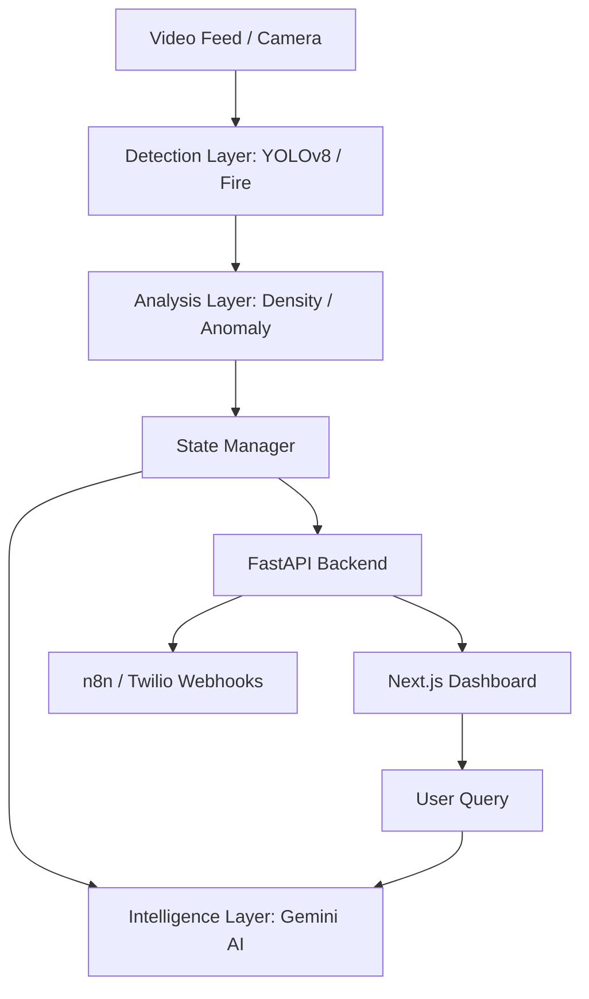

# Project Drishti 👁️

[](https://www.python.org/)
[](https://fastapi.tiangolo.com/)
[](https://nextjs.org/)
[](https://ai.google.dev/)

**Project Drishti** (Sanskrit for "Vision") is an intelligent, real-time surveillance and crowd safety system. It leverages state-of-the-art Computer Vision (YOLOv8) and Generative AI (Google Gemini) to transform passive video feeds into proactive safety intelligence.

## 🚀 Key Features

- **🔍 Multi-Layer Detection**: 
    - Real-time object detection (People, backpacks, equipment).
    - Advanced Fire and Smoke detection with hybrid heuristic-AI logic.
    - Intelligent Crowd Density calculation (m² based).
- **🧠 Decision Intelligence**:
    - **Google Gemini Integration**: High-level situation analysis and strategic guidance.
    - **Anomaly Detection**: Identifies erratic crowd movements or unusual behavior.
    - **Natural Language Query**: Command Center can "ask" the system about current status in plain English.
- **📱 Autonomous Response**:
    - **Emergency Notifications**: Direct WhatsApp alerts via Twilio when critical thresholds are met.
    - **n8n Webhook Integration**: Trigger complex external workflows automatically.
- **📊 Command Center Dashboard**:
    - Ultra-low latency video streaming.
    - Real-time metrics visualization (Trend analysis, risk scores).
    - Interactive agent action logs.

## 🏗️ Technical Architecture



## 🛠️ Tech Stack

- **Backend**: FastAPI, Python, OpenCV, Ultralytics (YOLOv8)
- **Frontend**: Next.js, Framer Motion, Lucide Icons, Tailwind CSS
- **AI/LLM**: Google Gemini 2.5 Flash (via `google-generativeai`)
- **Automations**: n8n, Twilio (WhatsApp API)

## 📂 Project Structure

- `backend/`: FastAPI server, video processing, and core components.
    - `backend/detection/`: Specialized modules for object, fire, and crowd analysis.
    - `backend/intelligence/`: Gemini integration and strategic decision engine.
- `frontend/`: Next.js application (Command Center Dashboard).
- `data/`: Sample videos and static assets.

## 🏁 Getting Started

### Prerequisites

- Python 3.10+
- Node.js 18+
- [Gemini API Key](https://aistudio.google.com/)
- Twilio Account (for WhatsApp alerts)

### 1. Backend Setup

1. Create a virtual environment:
   ```bash
   python -m venv venv
   source venv/bin/activate  # On Windows: venv\Scripts\activate
   ```
2. Install dependencies:
   ```bash
   pip install -r requirements.txt
   ```
3. Create a `.env` file in the root:
   ```env
   GEMINI_API_KEY=your_gemini_key
   TWILIO_ACCOUNT_SID=your_sid
   TWILIO_AUTH_TOKEN=your_token
   TWILIO_WHATSAPP_NUMBER=whatsapp:+1234567890
   N8N_WEBHOOK_URL=your_webhook
   ```
4. Run the backend:
   ```bash
   cd backend
   python main.py
   ```

### 2. Frontend Setup

1. Navigate to the frontend directory:
   ```bash
   cd frontend
   ```
2. Install dependencies:
   ```bash
   npm install
   ```
3. Run the development server:
   ```bash
   npm run dev
   ```

## 🚢 Deployment & Structure Advice

For production deployment, consider the following rearrangements:

1. **Module Consolidation**: Move `detection/` and `intelligence/` inside the `backend/` directory to simplify the import structure and package management.
2. **Containerization**: Use Docker Compose to orchestrate the Backend, Frontend, and any supporting services (like Redis or n8n local).
3. **Storage**: Offload video files from `data/` to a cloud storage provider (AWS S3, Google Cloud Storage) if the project expands beyond demo usage.

---
Built with ❤️ by Project Drishti Team
